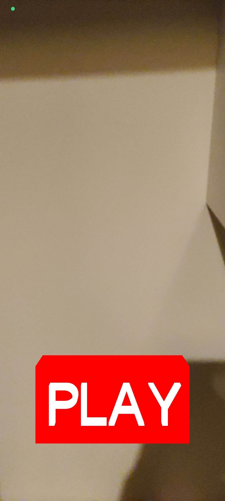
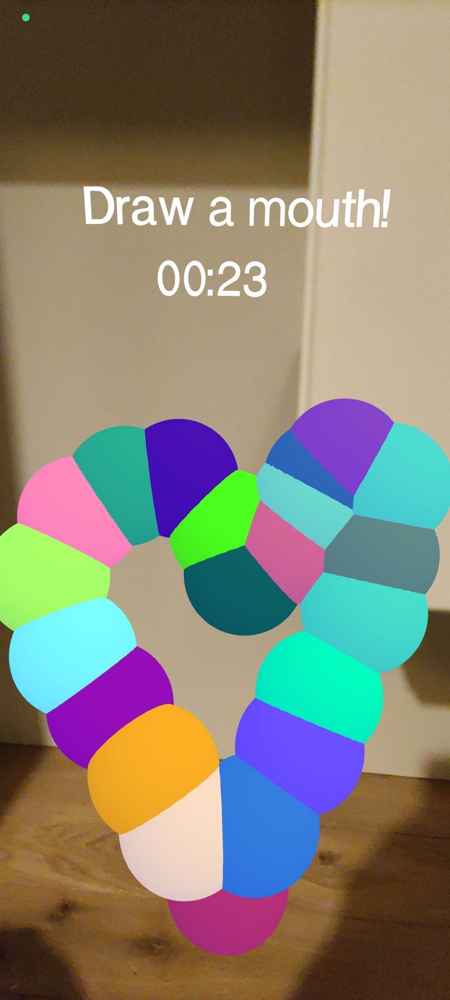

# Web AR Anatomy Pictionary

## Description

Web AR Anatomy Pictionary is an interactive augmented reality (AR) game that allows users to draw and learn human anatomy in a fun way. Using Three.js and WebXR, this project offers an immersive experience where users can interact with 3D objects and UI elements in AR.

## Features

- **Augmented Reality (AR)**: Using WebXR for an immersive experience.
- **3D Interaction**: Integration of Three.js for manipulating 3D objects.
- **Educational Game**: Learn human anatomy by drawing different body parts.
- **Dynamic User Interface**: Interactive 3D buttons and texts.
- **Sound Effects**: Sounds and music for an enriched experience.

## Prerequisites

- Node.js (version 14 or higher)
- npm (version 6 or higher)

## Installation

1. Clone the repository:
  ```sh
  git clone https://github.com/Nalhab/web-ar.git
  cd web-ar
  ```

2. Install dependencies:
  ```sh
  npm install
  ```

## Alternative

You can play without installing anything on this website: [Web AR Anatomy Pictionary](https://nalhab.github.io/web-ar/).

## Scripts

- **Development**: To start the development server.
  ```sh
  npm run dev
  ```

- **Build**: To build the project for production.
  ```sh
  npm run build
  ```

- **Clean**: To clean the build files.
  ```sh
  npm run clean
  ```

- **Preview Server**: To preview the production build.
  ```sh
  npm run preview
  ```

## Usage

1. Start the development server:
  ```sh
  npm run dev
  ```

2. Open your browser and go to `http://localhost:5173`.

3. Use an AR-compatible device for the best experience.

## How to Play

First, the user will be asked to draw a body part. They will have 1 minute to draw it. Then, an alert will appear, depending on your device you will have to click "Start XR" again. During this time, the user has to give the device to the other player who will have to guess the body part.

## Project Structure

- **index.html**: Main HTML file.
- **main.js**: Main script containing the game logic and AR scene initialization.
- **main.css**: CSS styles for the project.
- **public/**: Folder containing public assets like 3D models and audio files.
- **.vscode/**: Visual Studio Code editor configuration.
- **vite.config.js**: Vite configuration for build and development.

## Main Dependencies

- **Three.js**: JavaScript library for creating and displaying 3D graphics.
- **WebXR**: API for augmented and virtual reality on the web.
- **Cannon-es**: Physics engine for 3D simulations.
- **React**: JavaScript library for building user interfaces.

## Examples





## Credits

This project uses musics from Pixabay.

## License

This project is licensed under the MIT License. See the [LICENSE](LICENSE) file for more details.

## Contact

Nathan - [Email](mailto:nathan.labernardiere@epita.fr)

Mathieu - [Email](mailto:mathieu.cimolai@epita.fr)